

# Beacon — Маяк

**Тихий помощник для Windows · Quiet Windows productivity tool**

[🇷🇺 Русский](#-русский) · [🇬🇧 English](#-english)

---

## 🇷🇺 Русский

### О программе

**Beacon (Маяк)** — компактный инструмент для Windows, который живёт в системном трее и не мешает, пока не нужен. Напоминает о задачах, хранит заметки и пароли, держит стикеры на рабочем столе — всё локально, без облака, без подписки, без слежки.

### Скриншоты

| Задачи и напоминания | Заметки |
|:---:|:---:|
| 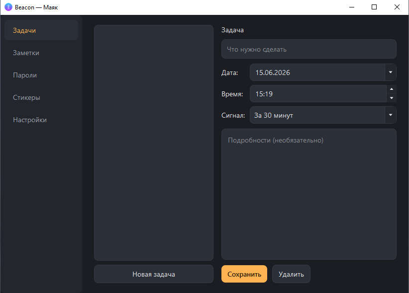 | 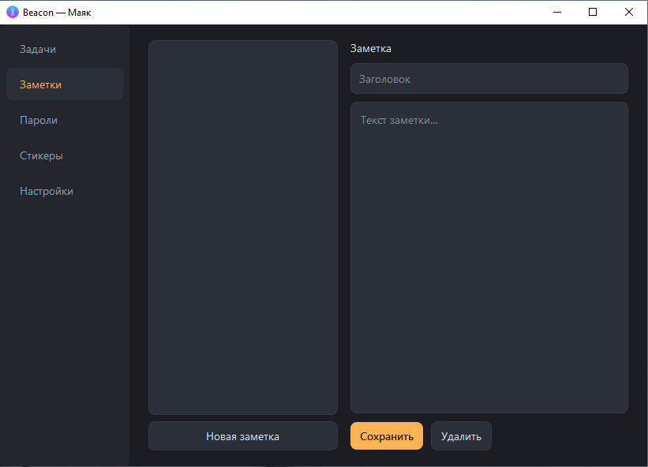 |

| Хранилище паролей | Стикеры на рабочем столе |
|:---:|:---:|
| 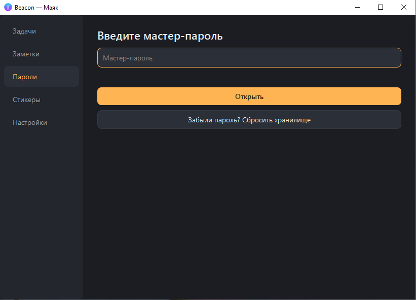 | 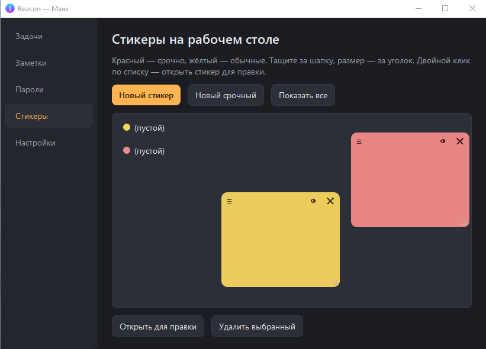 |

| Настройки | Меню трея |
|:---:|:---:|
| 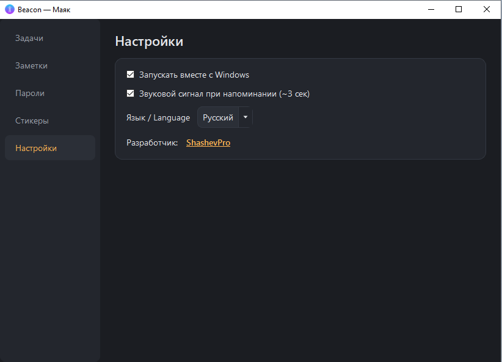 | 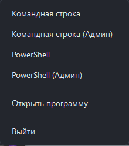 |

### Возможности

🔔 **Задачи и напоминания**
Создавай задачи со сроком, выбирай за сколько напомнить — от «в момент события» до «за 1 день». Нативные уведомления Windows + звуковой сигнал. Всё хранится локально.

📝 **Заметки**
Простой блокнот всегда под рукой. Список слева, редактор справа. Быстро и без лишнего.

🔐 **Хранилище паролей**
Шифрование AES-256-GCM. Мастер-пароль нигде не хранится — только ты знаешь ключ. Буфер обмена очищается автоматически через 30 секунд после копирования пароля.

🗒️ **Стикеры на рабочем столе**
Жёлтые (обычные) и красные (срочные). Перетаскиваются за шапку, размер меняется за уголок. Остаются на месте после перезапуска.

💻 **Быстрый запуск терминалов**
Командная строка и PowerShell (в т.ч. с правами администратора) — одним кликом из меню трея.

⚙️ **Гибкие настройки**
Автозапуск вместе с Windows, звук напоминаний вкл/выкл, интерфейс на русском или английском.

### Установка и запуск

1. Скачай последний релиз: [**Releases →**](https://github.com/andryhasayan-source/beacon/releases)
2. Распакуй архив в любую папку
3. Запусти `Beacon.exe`

> Установка не требуется. Программа не пишет ничего в систему кроме ключа автозапуска в реестре (только если ты его включишь в настройках). Все данные хранятся в `%APPDATA%\Beacon\`.

### Системные требования

- Windows 10 / 11 (64-бит)
- Без дополнительных зависимостей — всё включено в архив

---

## 🇬🇧 English

### About

**Beacon** is a compact Windows tool that lives in the system tray and stays out of your way until needed. It reminds you about tasks, stores notes and passwords, keeps sticky notes on your desktop — all locally, no cloud, no subscription, no tracking.

### Screenshots

| Tasks & Reminders | Notes |
|:---:|:---:|
| 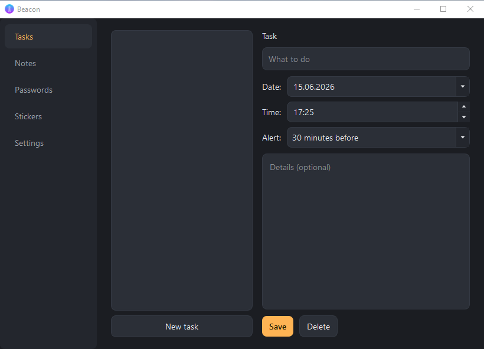 | 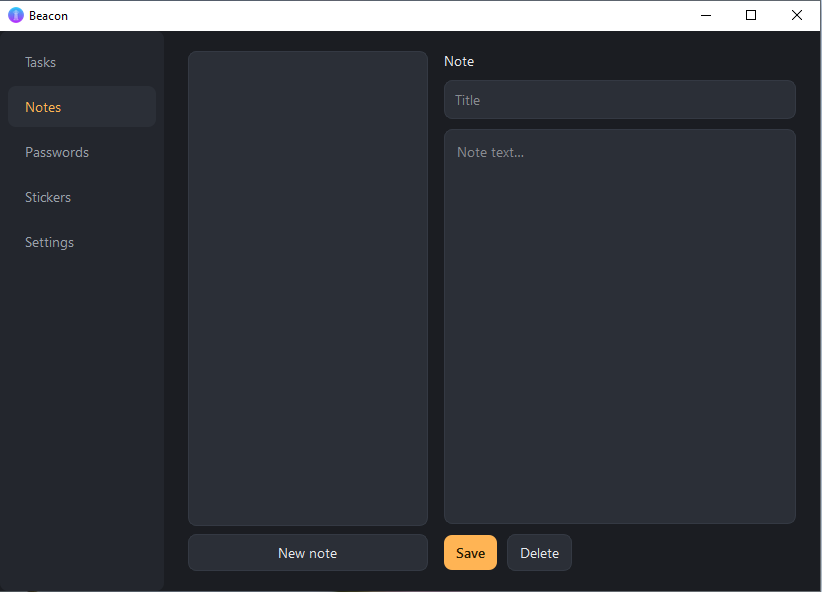 |

| Password vault | Desktop stickers |
|:---:|:---:|
| 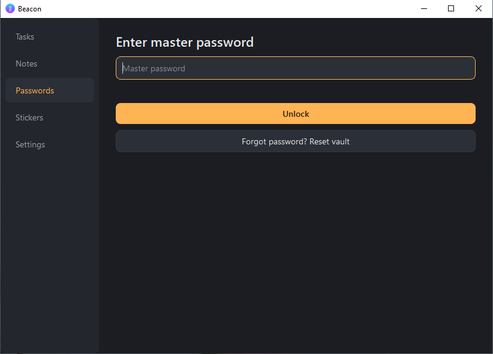 | 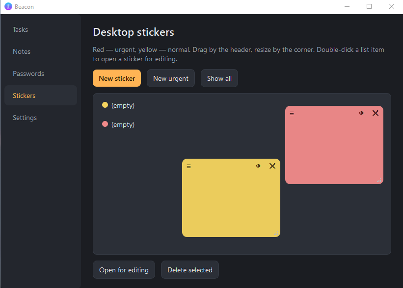 |

| Settings | Tray menu |
|:---:|:---:|
| 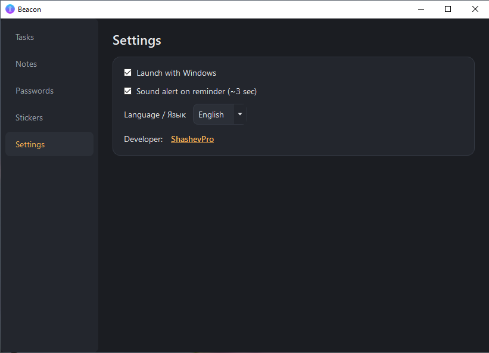 | 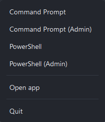 |

### Features

🔔 **Tasks & Reminders**
Create tasks with due dates, choose how early to be notified — from "at the time" to "1 day before". Native Windows notifications + sound alert. Everything stored locally.

📝 **Notes**
A simple notepad always at hand. List on the left, editor on the right. Fast and clean.

🔐 **Password vault**
AES-256-GCM encryption. The master password is never stored — only you hold the key. Clipboard auto-clears 30 seconds after copying a password.

🗒️ **Desktop stickers**
Yellow (normal) and red (urgent). Drag by the header, resize by the corner. Position persists between launches.

💻 **Quick terminal launch**
Command Prompt and PowerShell (including admin) — one click from the tray menu.

⚙️ **Flexible settings**
Launch with Windows, sound alerts on/off, Russian or English interface.

### Installation

1. Download the latest release: [**Releases →**](https://github.com/andryhasayan-source/beacon/releases)
2. Extract the archive to any folder
3. Run `Beacon.exe`

> No installation required. The app writes nothing to your system except an autostart registry key (only if you enable it in Settings). All data is stored in `%APPDATA%\Beacon\`.

### System requirements

- Windows 10 / 11 (64-bit)
- No additional dependencies — everything is included

---
- 🌐 [shashevpro.ru](https://www.shashevpro.ru)
- 🛒 [kwork.ru/user/shashevpro](https://kwork.ru/user/shashevpro)
- ✉️ programmer@shashevpro.ru
- 💬 [vk.com/shashevpro](https://vk.com/shashevpro)

**[⬇️ Download latest release](https://github.com/andryhasayan-source/beacon/releases)**

Developed by [ShashevPro](https://www.shashevpro.ru/)

